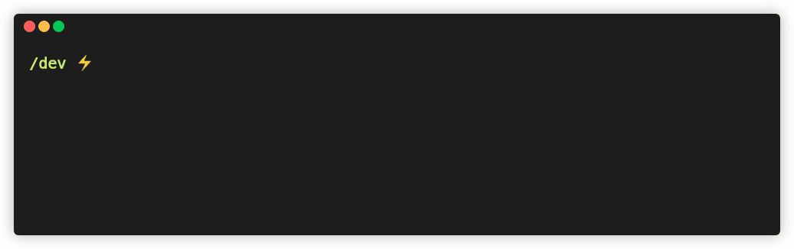

# sxp-wallet-mass-generator
> Generate a lot a Solar SXP wallets 👛



Generate a lot of [SXP](https://solar.org/) wallets quickly. This can be useful to find a fun wallet address.

Uses Node.js [Worker Threads](https://nodejs.org/api/worker_threads.html) for optimal performance (will use a Polyfill if Node.js version is less than 12).

## Install

```
$ yarn global add sxp-wallet-mass-generator
# or npm i -g sxp-wallet-mass-generator
```

## Usage

```
$ sxp-wallet-mass-generator --help

  Usage
    $ sxp-wallet-mass-generator
  
  Options
    --file -f         Output file [Default: "_sxpWallets.txt"]
    --amount -a       Amount of wallets to generate [Default: 100]
    --network -n      Blockchain network [Default: "devnet"]
    --no-logs         Hide all logging output
    --show-wallets    Print wallets to the terminal instead of the progress bar [Default: false]

  Examples
    $ sxp-wallet-mass-generator
    $ sxp-wallet-mass-generator --network="mainnet"
    $ sxp-wallet-mass-generator --file="_sxpWallets.txt" --amount 500000
    $ sxp-wallet-mass-generator --amount 500 --no-logs --network="testnet"
    $ sxp-wallet-mass-generator --show-wallets

  https://github.com/mrmikeo/sxp-wallet-mass-generator
```

## Output
Generated wallets will be appended to your output file with the following format:

```
SVSqgf9DXMtBFJtpBsktF7Mo8B4vdiSds6:depth fox public forward insect sphere ignore what quit afraid that armor
SWSSducreLcuPcwR9UayHauj8pazFp4DMn:army movie panel tonight disorder stumble travel ladder chaos grow tackle web
STK2CfnpzxDUvgg92KP1mG4ScvcAmFrgrs:bottom arrow permit soft crane effort please under left artist glove battle
SaCmgrMkRCdzacYNtMFK2TQqyQPD2ownba:flight spirit arena trust gold grab father taste else lemon kiss mind
ST2PXPK8Q3YdaGcUGCxSn2x2jZs8VKewan:winner total copper side expose upset must ignore fiscal collect member limb
SkY5uvnVTb8jfkPpLcitYPDdw4eARVBpDr:solution mind execute treat rude crumble usage fever chaos ostrich dilemma man
```

___

## Programmatic usage
### Install

```
$ yarn add sxp-wallet-mass-generator
# or npm i sxp-wallet-mass-generator
```

### `generateWallets`
Generate some wallets in memory and returns them. If you generate a lot (I mean, a very huge amount), you may run out of memory and should use [generateWalletsFs](#generateWalletsFs) instead.

```ts
import { generateWallets } from 'sxp-wallet-mass-generator'

const wallets = await generateWallets({
  amount: 500,      // Amount of wallets
  network: 'devnet' // Target ARK network
})

console.log(wallets)
// => { address: string; passphrase: string }[]
```

### `generateWalletsFs`
Generate some wallets and append them to a file as they gets generated.\
Wallets are not stored in memory after generation, there's no limit to the amount of wallets you can generate with this.

```ts
import { generateWalletsFs } from 'sxp-wallet-mass-generator'

await generateWalletsFs({
  file: '_sxpWallets.txt', // Output file
  amount: 500,             // Amount of wallets
  network: 'devnet',       // Target ARK network
  logs: false              // Hide console logging
})
// => Wallets were appended to `_arkWallets.txt` 
```

## Benchmark
Intel Core i7-6700HQ CPU @ 2.60GHz (8 cores)

```
Generated 20000 wallets to "_sxpWallets.txt" in 208s.
=> 96.15 wallets/s
```

## Related
 - [ipfs-ark-stamp](https://github.com/rigwild/ipfs-ark-stamp) - 📝 Add files to IPFS and stamp its IPFS CID hash permanently on the ARK Blockchain

## License
[The MIT license](./LICENSE)
